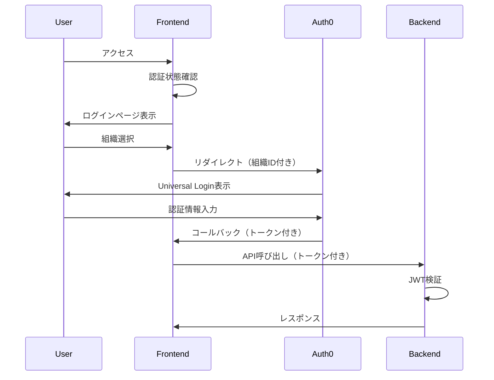

# Auth0 / Okta 実装ガイド

## 概要
このドキュメントは、ProcureERPシステムにAuth0 Customer Identity Cloud (CIC)を実装するための技術ガイドです。

## 現在の実装状況

### ✅ 完了済み

#### バックエンド
- [x] OktaAuthGuard実装済み（JWT検証）
- [x] OktaAuthModuleの設定
- [x] テナントインターセプター実装
- [x] グローバル認証ガードの設定
- [x] 環境変数テンプレート（.env.example）

#### フロントエンド  
- [x] Auth0 React SDKの追加（package.json）
- [x] Auth0 Provider実装
- [x] Protected Routeコンポーネント
- [x] APIクライアント（自動トークン付与）
- [x] ログインページのAuth0対応
- [x] コールバックページの実装
- [x] 環境変数テンプレート（.env.local.example）

#### ドキュメント
- [x] AUTH0_SETUP_GUIDE.md（詳細な設定手順）

### ⚠️ 設定が必要な項目

1. **Auth0アカウントの作成と設定**
   - AUTH0_SETUP_GUIDE.mdの手順に従って設定

2. **環境変数の設定**
   
   **フロントエンド（.env.local）**
   ```env
   NEXT_PUBLIC_AUTH0_DOMAIN=your-tenant.auth0.com
   NEXT_PUBLIC_AUTH0_CLIENT_ID=your-spa-client-id
   NEXT_PUBLIC_AUTH0_REDIRECT_URI=http://localhost:3000/callback
   NEXT_PUBLIC_AUTH0_AUDIENCE=https://api.procure-erp.com/v1
   NEXT_PUBLIC_AUTH0_SCOPE=openid profile email org_id
   NEXT_PUBLIC_API_URL=http://localhost:3001
   ```
   
   **バックエンド（.env）**
   ```env
   PORT=3001
   OKTA_ISSUER=https://your-tenant.auth0.com/
   OKTA_CLIENT_ID=your-spa-client-id
   OKTA_AUDIENCE=https://api.procure-erp.com/v1
   CORS_ORIGIN=http://localhost:3000
   ```

3. **依存関係のインストール**
   ```bash
   # フロントエンド
   cd frontend
   npm install
   
   # バックエンド
   cd ../backend
   npm install
   ```

## アーキテクチャの概要

### 認証フロー



### マルチテナント構成

- **Organizations機能**: 各顧客企業は1つのOrganization
- **テナントID**: Auth0のOrganization IDをそのまま使用
- **ブランディング**: Organization毎にカスタマイズ可能

## 主要コンポーネント

### フロントエンド

1. **Auth0Provider** (`/lib/auth/auth0-provider.tsx`)
   - Auth0の初期化とコンテキスト提供
   - 組織別ログイン機能

2. **ProtectedRoute** (`/lib/auth/protected-route.tsx`)
   - 認証が必要なルートの保護
   - 権限ベースのアクセス制御

3. **APIClient** (`/lib/auth/api-client.ts`)
   - 自動的にアクセストークンを付与
   - エラーハンドリング

### バックエンド

1. **OktaAuthGuard** (`/infrastructure/external-services/okta/okta-auth.guard.ts`)
   - JWT検証
   - ユーザー情報の抽出

2. **Decorators** (`/infrastructure/external-services/okta/okta.decorators.ts`)
   - `@Public()`: 認証不要エンドポイント
   - `@CurrentUser()`: ユーザー情報取得
   - `@RequirePermissions()`: 権限チェック

## 開発手順

### 1. Auth0のローカル開発環境セットアップ

```bash
# 1. 環境変数ファイルの作成
cd frontend
cp .env.local.example .env.local
# .env.localを編集してAuth0の情報を入力

cd ../backend  
cp .env.example .env
# .envを編集してAuth0の情報を入力
```

### 2. アプリケーションの起動

```bash
# バックエンドの起動
cd backend
npm run start:dev

# フロントエンドの起動（別ターミナル）
cd frontend
npm run dev
```

### 3. 動作確認

1. http://localhost:3000 にアクセス
2. ProtectedRouteによりログインページにリダイレクトされることを確認
3. 組織を選択して「Auth0でサインイン」をクリック
4. Auth0のUniversal Loginページで認証
5. ダッシュボードにリダイレクトされることを確認

## トラブルシューティング

### よくある問題

1. **CORS エラー**
   - Auth0ダッシュボードでAllowed Web Originsを確認
   - バックエンドのCORS設定を確認

2. **Invalid audience エラー**
   - フロントエンドとバックエンドのAUDIENCEが一致しているか確認
   - Auth0のAPI設定を確認

3. **Organization not found**
   - ユーザーが組織に所属しているか確認
   - Organization IDが正しいか確認

4. **JWT検証エラー**
   - OKTA_ISSUERの末尾に`/`があるか確認
   - トークンの有効期限を確認

## カスタマイズポイント

### ログインページのカスタマイズ

`/frontend/app/login/page.tsx`で以下をカスタマイズ可能：
- テナントリスト（現在はDEMO_TENANTS）
- ブランディング
- 自動テナント検出ロジック

### 権限管理

1. Auth0でロールと権限を定義
2. `ProtectedRouteWithPermissions`を使用して権限チェック
3. バックエンドで`@RequirePermissions`デコレーターを使用

### テナント別設定

1. Organization metadataを使用
2. カスタムクレームでテナント情報を追加
3. バックエンドでテナントコンテキストを利用

## 次のステップ

1. **本番環境の設定**
   - カスタムドメインの設定
   - 本番環境のURLを追加
   - Rate Limitsの確認

2. **高度な機能の実装**
   - SCIM プロビジョニング
   - エンタープライズSSO（SAML/OIDC）
   - 条件付きMFA

3. **監視とログ**
   - Auth0のログストリーミング設定
   - エラー監視の実装

## 参考資料

- [Auth0 Documentation](https://auth0.com/docs)
- [Auth0 React SDK](https://auth0.com/docs/libraries/auth0-react)
- [Auth0 Organizations](https://auth0.com/docs/manage-users/organizations)
- [JWT Debugger](https://jwt.io/)
